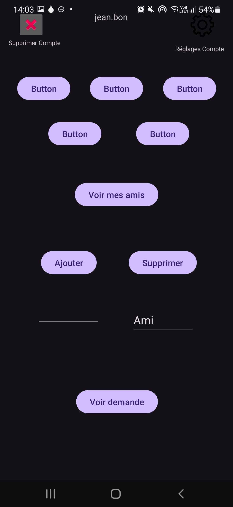
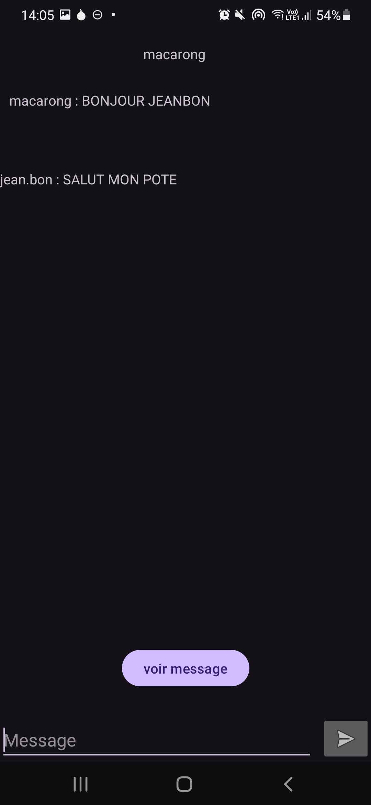
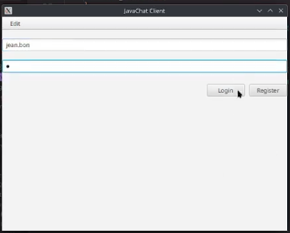
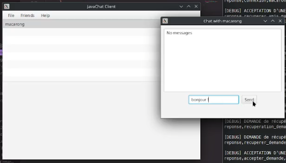

# Compte Rendu SAé 302 : Développer des applications communicantes

Réalisation d'une application client/serveur utilisant les fonctions communicantes permettant de
concevoir un protocole applicatif au-dessus de la pile de communication TCP/IP.

## Les fonctionalités du serveur seront les suivantes

1. Le serveur permet de gérer un total de 10 utilisateurs.

2. Un utilisateur est identifié par un email et un mot de passe stockés en clair.
   
3. Un message est une chaîne de caractères définit par une action/commande (INVITATION
ou MESSAGE), par une origine, par le destinataire et par un corps de message.

4. Chaque utilisateur est autorisé à avoir jusqu’à __x__ amis.
   
5. Le serveur stocke les messages relatifs aux utilisateurs en mémoire RAM.
   
6. Un nombre presque illimité de messages peuvent être stocker dans la mémoire RAM. _(Les précédents sont automatiquement supprimés.)_
   
7. Le destinataire du message peut être “TOUS” Dans ce cas, le serveur réplique le message vers tous les amis de l’émetteur. Semblable à un ***Broadcast***
   
8. Pour consulter ses messages, l’utilisateur connecté doit envoyer un message de lecture de
ses messages au format *“lecture,login”*. (côté client l’utilisateur lit les messages chaque
10 secondes).

9. Pour inviter un autre utilisateur, l’invitant envoie un message *“demande_ami,login,ami”*.
    
10.  A l’acceptation d’une invitation, l’invitant reçoit un message du serveur lui notifiant cette acceptation.
    

## Organisation du travail

Nous étions déjà tous d'accord pour faire du versionnage avec GitHub. Nous avions les repositories déjà créer avant le début de la SAé.

Lundi nous avons constituer notre équipe de 4 : Enzo MANZINALI, Bastien LAURENT, Anas IDIRI et Romain MARC.
La répartition des rôles fut assez rapide à appliqué étant donner que nous étions tous rapidement d'accord sur comment produire le travail demandé. Nous nous sommes tous réunis pour mettre en place le protocol qui sera la colonne vertébrale du projet (*sprint planning*).
Anas s'est appliqué sur le backend du serveur, pendant qu'Enzo, Romain et Bastien commençaient à travailler sur le client.

Mardi, Anas avança sur le serveur avec Bastien, pendant que Romain et Enzo travaillaient sur le client.

Mercredi, nous avons terminer officielement le serveur avec toutes ses fonctionalités. Enzo commença à créer le client pour PC en utilisant JavaFX sur VSCode, permettant d'implémenter facilement un GUI. Nous avons continué d'améliorer le Client Android, nous demandant plus d'effort.

Jeudi, nous avons compléter le cahier des charges ainsi que commencer à rédiger le compte-rendu ainsi qu'à préparer la présentation.

## Serveur JavaChat

Pour pouvoir compiler il faut la dépendence *Ant*, *make* sera nécessaire pour automatiser et Java23 pour le lancer.

Le serveur à pour package .com.server. et écoutera sur le port 1337.

Pour lancer le serveur faire
```bash
make
```
dans le dossier `./source`

Il existe trois manières pour intéragir avec le serveur : 
```
# Interagir avec le serveur
make client
# Ou via le script prévu à cet effet
python3 script.py
# Ou en plus bas level
nc -vu 127.0.0.1 1337
```
Le serveur peut être tester avec ``script.py``

## Client Android JavaChat

Le client peut être lancer dans l'émulateur *Android Studio* ou en téléchargeant l'APK sur son smartphone.


L'utilisateur peut créer son compte en cliquant sur *Sign Up*.



L'utilisateur peut se connecter sur la page d'accueil puis ajouter des amis en indiquant son ID et en cliquant sur *Ajouter*.
Le boutton pour *Supprimer* n'est pas encore fonctionnel côté client.




Le Client Android met à jour les messages reçus seulement lorsque le boutton afficher messages est cliqué. Au total, 8 messages peuvent être stockés sur le client Android.

## Client PC JavaChat

Le client PC fut créer avec JavaFX sur VSCode. Il contient les mêmes fonctionalités que le client Android, mais est dynamique.



Client PC se connecte sur son compte



Chat lancé entre 2 amis sur le client PC.
Le Client met à jour les messages reçus toutes les 10 secondes. Une infinité de messages sont stockés sur le client PC.